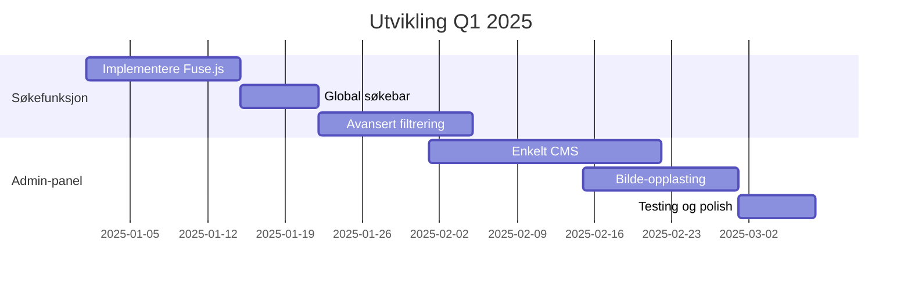

# 🚗 Norsk Franklinregister - Prosjektdokumentasjon

> **Ein moderne nettstad for norske H. H. Franklin bil-entusiaster**  
> **URL**: [norskfranklinregister.no](https://norskfranklinregister.no)  
> **Sist oppdatert**: 6. oktober 2025

---

## 📋 Innholdsfortegnelse

- [Prosjektoversikt](#-prosjektoversikt)
- [Teknisk arkitektur](#-teknisk-arkitektur)
- [Gjennomførte implementasjonar](#-gjennomførte-implementasjonar)
- [Nåværande funksjonalitet](#-nåværande-funksjonalitet)
- [Kommande forbetringar](#-kommande-forbetringar)
- [Utviklingsplan](#-utviklingsplan)
- [Teknisk gjeld og vedlikehald](#-teknisk-gjeld-og-vedlikehald)

---

## 🎯 Prosjektoversikt

**Norsk Franklinregister** er ein dedikert nettstad for entusiaster av H. H. Franklin-biler i Norge. Nettsida fungerer som eit register over norske Franklin-biler, med omfattande informasjon om historikk, tekniske detaljar og eierskapar.

### **Målgruppe**
- Franklin bil-eiere i Norge
- Klassiske bil-entusiaster  
- Bilhistorie-interesserte
- Forskere og journalister
- Internasjonale Franklin-samfunn

### **Hovudmål**
- Dokumentere og bevare kunnskap om Franklin-biler i Norge
- Gi ein sentral plass for norske Franklin-ressursar
- Dele historikk og teknisk informasjon
- Bygge samfunn rundt Franklin-entusiasme

---

## 🏗 Teknisk arkitektur

### **Teknologistack**

| Komponent | Teknologi | Versjon | Formål |
|-----------|-----------|---------|---------|
| **Framework** | Astro | 5.6.1 | Static Site Generator med SSR |
| **Frontend** | React | 19.0.0 | Interaktive komponenter |
| **Styling** | Tailwind CSS | 4.1.3 | Utility-first CSS framework |
| **UI Library** | RSuite | 5.83.3 | React komponentbibliotek |
| **Carousel** | Swiper.js | 12.0.2 | Moderne touch-enabled gallerier |
| **Deploy** | Netlify | - | Edge hosting og SSR |
| **Fonts** | Fontsource | - | Josefin Sans, Playfair Display |

### **Prosjektstruktur**

```
norskfranklin/
├── src/
│   ├── components/          # React/Astro komponenter
│   │   ├── SEO.astro       # Dynamisk SEO-metadata
│   │   ├── SwiperCarousel.jsx  # Moderne bildekarusell
│   │   ├── SwiperModal.jsx     # Modal bildevisning
│   │   ├── NavBar.astro        # Navigasjon
│   │   └── Footer.astro        # Sidefot
│   ├── data/               # JSON-baserte data
│   │   ├── franklins.json      # Bil-database
│   │   ├── images.json         # Bilderesurser
│   │   └── resources.json      # Eksterne lenker
│   ├── layouts/            # Sidemal
│   │   └── Layout.astro        # Hovudlayout
│   ├── pages/              # Routing
│   │   ├── cars/[id]/         # Dynamiske bilsider
│   │   ├── sitemap.xml.ts     # Auto-generert sitemap
│   │   └── robots.txt.ts      # SEO-konfigurasjon
│   └── styles/             # Global CSS
├── public/                 # Statiske ressurser
│   ├── images/            # Bil-bilder og media
│   └── favicon.svg        # Ikon
└── astro.config.mjs       # Astro-konfigurasjon
```

### **Deployment**
- **Platform**: Netlify med Edge Functions
- **Build**: Automatisk frå GitHub main branch
- **SSR**: Server-side rendering for dynamisk innhald
- **CDN**: Global distribution via Netlify Edge

---

## ✅ Gjennomførte implementasjonar

### **2025 - Hovudutvikling**

#### **🎨 Moderne brukargrensesnitt**
- ✅ Responsivt design med Tailwind CSS
- ✅ Elegant navigasjon med aktive tilstandar
- ✅ Profesjonelle skyggeeffektar og overganger
- ✅ Tilgjengeleg design med semantisk HTML

#### **🖼 Avanserte bildegallerier**
- ✅ **Swiper.js integrering** med touch-støtte
- ✅ **Modal bildevisning** med keyboard-navigasjon
- ✅ **Autoplay** og elegante overganger
- ✅ **Responsive** bilder for alle skjermstørrelser
- ✅ **Thumbnail-grid** til fullskjerm modal-opplevelse

#### **🚗 Bil-database og navigasjon**
- ✅ **Dynamiske bilsider** med tekniske detaljar
- ✅ **Navigasjon mellom biler** (forrige/neste)
- ✅ **Album-sider** for fleire bilder
- ✅ **Eierskapsinformasjon** og bilhistorie
- ✅ **Sortering etter år** for logisk navigasjon

#### **🔍 SEO og søkemotoroptimalisering**
- ✅ **Dynamisk metadata** for alle sider
- ✅ **Structured data** (Schema.org) for rich snippets
- ✅ **Open Graph** og Twitter Cards
- ✅ **Automatisk sitemap** generering
- ✅ **robots.txt** konfigurasjon
- ✅ **Canonical URLs** og norsk språkkode

#### **⚡ Ytelse og teknisk kvalitet**
- ✅ **Netlify-optimalisering** med edge functions
- ✅ **Cross-platform builds** med optional dependencies
- ✅ **TypeScript** support for type-sikkerhet
- ✅ **Modern CSS** med Tailwind v4
- ✅ **Font optimization** med Fontsource

---

## 🌟 Nåværande funksjonalitet

### **Brukaropplevelse**
- **Intuitiv navigasjon** mellom hovudseksjonar
- **Responsiv design** som fungerer på alle enheter
- **Touch-optimaliserte** bildegallerier
- **Keyboard-tilgjenge** for universell bruk
- **Elegant loading** og overganger

### **Innhaldsstruktur**
- **Forsida** med hero-seksjon og introduksjon
- **Historikk-sida** med Franklin timeline
- **Bil-oversikt** med sorterte lister
- **Individuelle bilsider** med detaljar og bilder
- **Album-sider** med moderne modal-gallerier
- **Kontakt-skjema** for innlevering av innhald
- **Ressurs-sida** med eksterne lenker

### **Data-management**
- **JSON-basert** bil-database med 12 registrerte biler
- **Bildearkiv** organisert etter eiere
- **Metadata** for tekniske spesifikasjonar
- **Eigerskapsinformasjon** og historikk

---

## 🚀 Kommande forbetringar

### **🔍 Høg prioritet (Q1 2025)**

#### **1. Søk og filtrering**
```javascript
// Implementere med Fuse.js for fuzzy search
const searchOptions = {
  keys: ['year', 'name', 'owner', 'characteristics'],
  threshold: 0.3
};
```
- **Global søkebar** i navigasjonen
- **Filtrering** på år, modell, eier
- **Avansert søk** med multiple kriterier
- **Søkeresultat-highlighting**

#### **2. Bildeoptimasering**
- **WebP/AVIF** konvertering for moderne format
- **Lazy loading** for raskare sidelasting
- **Responsive images** med srcset
- **Thumbnail-generering** automatisk
- **Alt-tekst optimalisering** for tilgjenge

#### **3. Admin-panel**
```astro
// Enkelt filbasert CMS
---
import AdminLayout from './AdminLayout.astro';
---
<AdminLayout>
  <BilEditor />
  <ImageUploader />
  <MetadataEditor />
</AdminLayout>
```
- **Enkelt redigeringsgrensesnitt** for bil-data
- **Bilde-opplasting** med automatisk prosessering
- **Metadata-redigering** for SEO
- **Preview-funksjon** før publisering

### **🎯 Medium prioritet (Q2 2025)**

#### **4. Database-overgang**
- **Supabase** eller PostgreSQL for skalering
- **Real-time** oppdateringar
- **Backup** og versjonering
- **API** for eksterne integrasjonar

#### **5. Analytics og innsikt**
- **Plausible Analytics** for personvern-venleg tracking
- **Brukarstatistikk** og populære sider
- **Søkeord-analyse** for SEO-forbetring
- **Performance monitoring**

#### **6. Innhald og funksjonalitet**
- **Kommentarsystem** for bil-sider
- **Favoritt-funksjon** for brukarar
- **Relaterte biler** forslag
- **Utvidet bilhistorie** med timeline
- **Tekniske samanlikningar** mellom modellar

### **🔧 Låg prioritet (Q3-Q4 2025)**

#### **7. Progressive Web App (PWA)**
- **Service Worker** for offline-lesing
- **App-install** funksjonalitet
- **Push notifications** for nye biler
- **Offline-synchronisering**

#### **8. Fleirspråkleg støtte**
- **Engelsk versjon** for internasjonale brukarar
- **i18n** struktur med Astro
- **Språkveljar** i navigasjonen
- **Oversett metadata** og SEO

#### **9. Community-funksjonar**
- **Brukarregistrering** og profiler
- **Event-kalender** for Franklin-arrangement
- **Forum** eller diskusjonsseksjon
- **Bilde-innlevering** frå brukarar

---

## 📊 Utviklingsplan

### **Fase 1: Søk og Admin (Januar-Mars 2025)**


### **Fase 2: Optimalisering (April-Juni 2025)**
- **Database-migrasjon** til Supabase
- **Performance tuning** og Core Web Vitals
- **Analytics** implementasjon
- **Innhaldsutvidelse** med fleire biler

### **Fase 3: Community (Juli-September 2025)**
- **PWA** funksjonalitet
- **Fleirspråkleg** støtte
- **Community-funksjonar**

---

## 🔧 Teknisk gjeld og vedlikehald

### **Prioriterte oppgaver**

#### **1. Dependency management**
```json
// Oppdatere avhengigheter regelmessig
{
  "astro": "^5.x.x",        // Holde oppdatert
  "react": "^19.x.x",       // Nyaste stable
  "tailwindcss": "^4.x.x"   // Beta til stable
}
```

#### **2. Code quality**
- **ESLint** strengare konfigurasjon
- **Prettier** konsistent formatering
- **TypeScript** konvertering av fleire komponenter
- **Unit tests** med Vitest
- **E2E tests** med Playwright

#### **3. Performance monitoring**
- **Lighthouse** scores tracking
- **Core Web Vitals** optimalisering
- **Bundle size** analyse
- **Loading performance** forbetring

#### **4. Security**
- **Dependency scanning** for vulnerabilities
- **CSP headers** implementasjon
- **Form validation** og sanitization
- **Rate limiting** på kontakt-skjema

### **Vedlikehaldsplan**
- **Månedleg**: Dependency updates
- **Kvartalsvis**: Performance audit
- **Halvårleg**: Security review
- **Årleg**: Teknologi-stack evaluering

---

## 📈 Suksessmålingar

### **Tekniske mål**
- **Lighthouse score**: >95 på alle kategoriar
- **Core Web Vitals**: Grøn status på alle metrics
- **SEO ranking**: Top 3 for "Franklin biler Norge"
- **Page load time**: <2 sekunder
- **Mobile usability**: 100% score

### **Innhaldsmål**
- **25+ registrerte biler** innan 2025
- **500+ bilder** i arkivet
- **Monthly visitors**: 1000+ innan 2025
- **Engagement**: 3+ sider per sesjon

### **Community-mål**
- **10+ aktive bidragsytere**
- **50+ innleverte bilder** frå brukarar
- **5+ arrangement** dokumentert årleg

---

## 🤝 Bidrag og kontakt

### **Prosjektansvarleg**
**Åge Jan Barlund**  
📧 barlund@gmail.com  
📞 411 86 371

### **Teknisk utvikling**
**Comino Web AS**  
🌐 [cominoweb.no](https://cominoweb.no)

### **Korleis bidra**
1. **Send inn bil-informasjon** via kontakt-skjemaet
2. **Del bilder** av din Franklin
3. **Foreslå forbetringar** via GitHub Issues
4. **Bidra med kode** via Pull Requests

---

## 📄 Lisens og opphavsrett

**Copyright © 2025 Norsk Franklinregister**  
Alle rettar reserverte for innhald og design.

**Open source komponenter** er lisensiert under sine respektive lisensar.  
**Bil-bilder** er eigedom av respektive fotografar og eiere.

---

*Dokumentet sist oppdatert: 6. oktober 2025*  
*Versjon: 1.0*